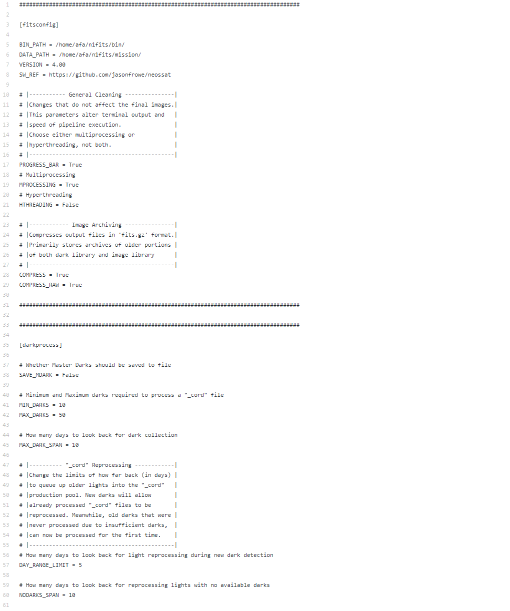

# NEOSSat FITS Processing Pipeline

This pipeline utilizes [Jason Rowe's image processing library](https://www.github.com/jasonfrowe/neossat) to automate the cleaning of downlinked NEOSSat images.


## Table of Contents

* **1.0 [ Dependencies ](#dep)**
* **2.0 [ Configuration ](#config)**
* **3.0 [ Running ](#run)**
* **4.0 [ Logging ](#log)**


<a name="dep"></a>

## 1.0 Dependencies

Install the following python libraries and general packages:

```
$ python3 -m pip install astropy
```
```
$ python3 -m pip install numpy
```
```
$ python3 -m pip install scipy
```
```
$ python3 -m pip install photutils
```
```
$ python3 -m pip install matplotlib
```


```
$ pip3 install tqdm
```

<a name="config"></a>

## 2.0 Configuration

To configure run, navigate to **../bin/fits_cleaner/config/config.ini**



&nbsp;&nbsp;&nbsp;&nbsp;&nbsp;&nbsp;*Figure 2.1: Values that can customize pipeline execution*


<a name="run"></a>

## 3.0 Running

Navigate to the bin folder:
```
$ cd ~/n1fits/bin/
```
\
First, we must create the library paths:
```
$ python3 launch_fits.py
```
\
Working image directory is **../mission/image/fitsprocessor/outgoing/ASTRO/**
 * *Place desired NEOSSat images here* 


\
 To process, run once more:
 ```
 $ python3 launch_fits.py
 ```


---
 Resulting images including: 
* Corrected overscan (**_cor**) 
* Corrected overscan with dark subtraction (**_cord**) 


 Can be found in **../mission/image/outgoing/ASTRO/**


<a name="log"></a>

## 4.0 Logging

*For general pipeline logging:*
\
**../mission/image/log/n1FITSProcessor[date-time]**
\
\
*For cleaner logging:*
\
**../mission/image/cleaner/logs/NEOS_[date-time].CLEANLOG**
\
\
*Incoming cleaner images:*
\
**../mission/image/cleaner/incoming/[date-time].cleanlist**
\
\
*Archived lights logging:*
\
**../mission/image/cleaner/data/dark_library/lightlists/[size].lightlist**
\
\
*Archived lights with no compatible darks:*
\
**../mission/image/cleaner/data/dark_library/lightlists/nodarks.lightlist**
